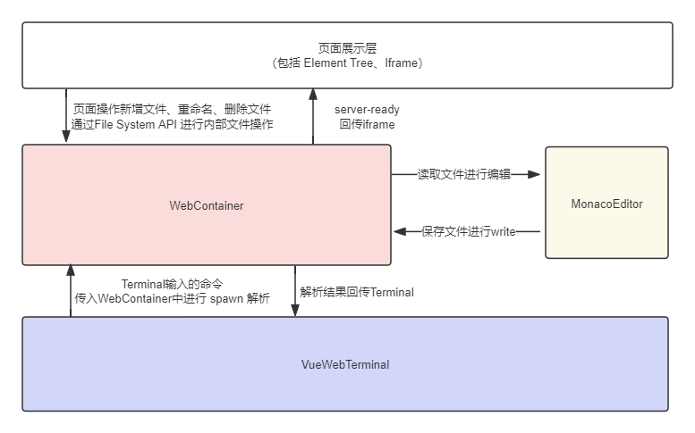

# Unicode-IDE 在线代码编辑器


## 技术说明

- Monaco Editor ：负责代码编辑、冲突模型处理等有关代码文件事项；
- WebContainer ：是整个Web运行项目的核心，提供了直接运行js文件的能力，同时具备Node API，可执行相关 npm i 、npm run dev 等命令；同时，其完备的 FileAPI 也是整个项目的关键，提供的文件操作API，给Web可直接操作文件，包括新建文件、重命名、删除文件、读取目录等多项能力；
- Vue-Web-Terminal ：一个由 Vue 构建的支持多内容格式显示的网页端命令行窗口插件，支持表格、json、代码等多种消息格式，支持自定义消息样式、命令行库、键入搜索提示等，模拟原生终端窗口支持 ← → 光标切换和 ↑ ↓ 历史命令切换。


## 系统架构图



​	如上图，WebContainer及MonacoEditor是整个系统的核心模块，通过File System API，进行文件操作，与页面展示层（Element Tree）进行交互，提供了虚拟文件的可视化功能；同时，启动后的服务，通过回传 iframe实现页面展示；

​	对Terminal而言，主要就是通过terminal的输入命令与spawn的交互，实现命令执行、回显；

​	而Monaco Editor则是从web Container中的文件关系进行文件读取编辑，保存后重新回写到Container中。


## 运行环境

- Node.js 18.x
- Vue.js 3.x
- Pnpm 8.x
- Vite 5.x
- Typescript 5.x
- Eslint 9.x

```shell

  ##  克隆仓库
  git clone https://gitee.com/wfeng0/unicode-ide.git
  
  ##  推荐使用pnpm进行依赖管理
  pnpm install
  
  ##  本地运行
  pnpm run dev

  ##  如果提交代码，请先执行 lint 与 build 命令进行代码检查与打包 ，确认没错误后再提交。
  pnpm run lint

  pnpm run build

```

## 整体效果


## 功能支持

- 新建文件/文件夹
- 文件icon图标显示
- 代码编辑、保存
- 多tab文件展示
- 命令执行、项目运行
- 格式化代码
- 文件重命名、删除文件、拖拽更换文件位置


## 计划开发

- diff 代码冲突模型对比
- Monaco Editor协同编辑
- 主题切换
- Terminal 优化
- 支持系统设置-可调整文件显示模式、主题切换
- 插件系统
- makrdown preview
- 对系统文件、图片提供支持，并提供 preview 功能


## 联系交流

如果对项目优化或功能有好的想法并乐意贡献代码欢迎提交[PR](https://gitee.com/wfeng0/unicode-ide/pulls) ，对项目使用存在疑问或发现bug请提交[issue](https://gitee.com/wfeng0/unicode-ide/issues)。

欢迎大家加入QQ群，不限于Socket.IO、前端技术、Node等，都可以进行沟通交流哦~

仓库有 master/develop 两个分支，master是稳定版本，develop 是最新版本，大家按需拉取。


